# Palworld Server Manager

A desktop app for Linux and Windows that runs one or more **Palworld dedicated servers** without the command line. Install a server or point the app at one you already have, then start it, change its settings, watch players and logs, take backups, schedule maintenance, and manage mods from one window.

This is an independently maintained hard fork of the original Palworld Server Manager, rewritten on Next.js and Electron. It is not affiliated with or endorsed by the original project or by Pocketpair.

## Screenshots

| Your servers | World overview |
| --- | --- |
| 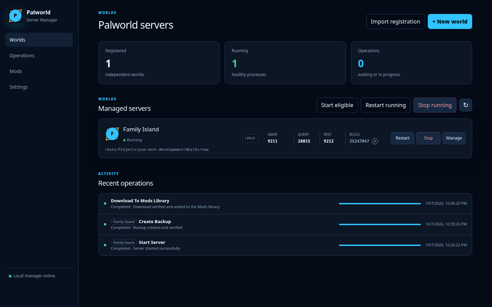 | 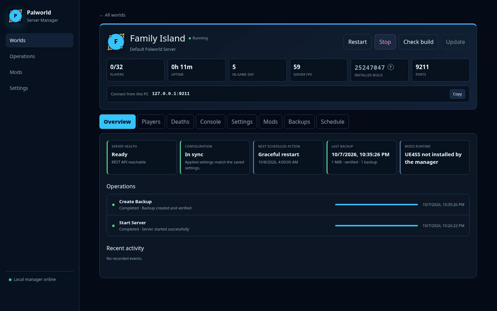 |

| Players | Live server log |
| --- | --- |
| 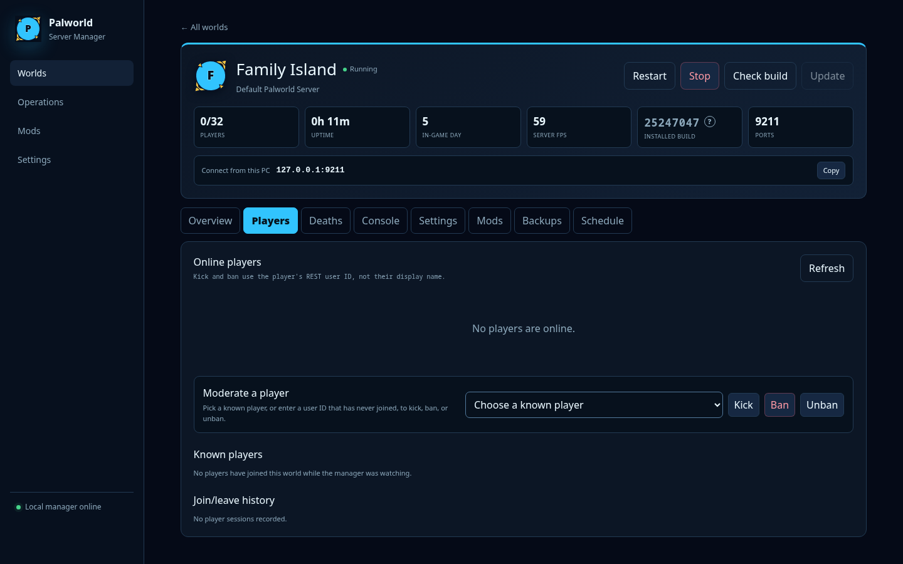 | 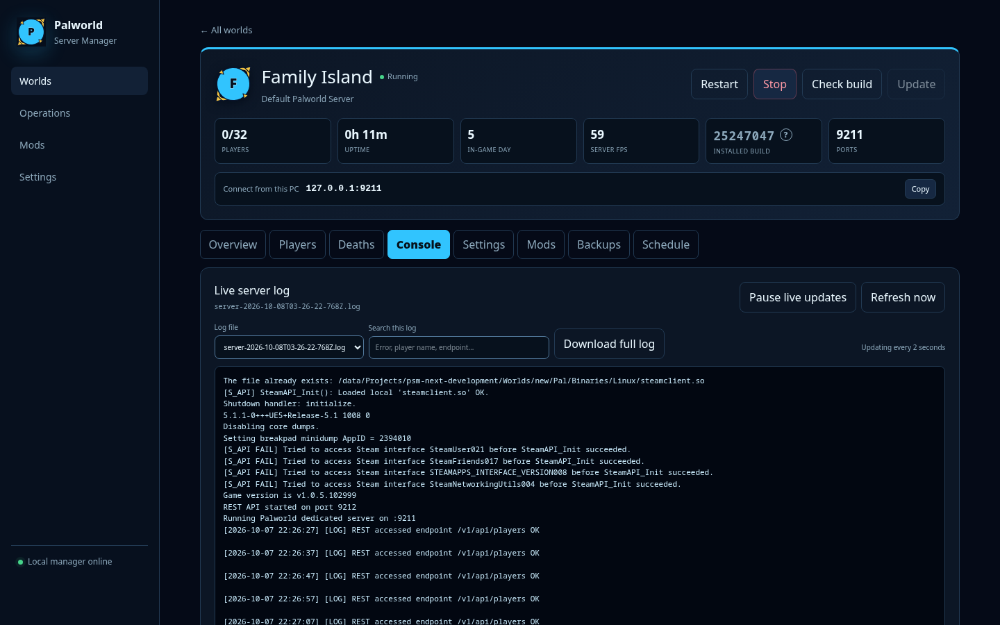 |

| Guided settings | Settings menu |
| --- | --- |
| 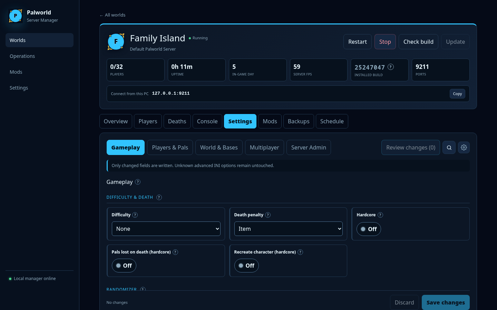 | 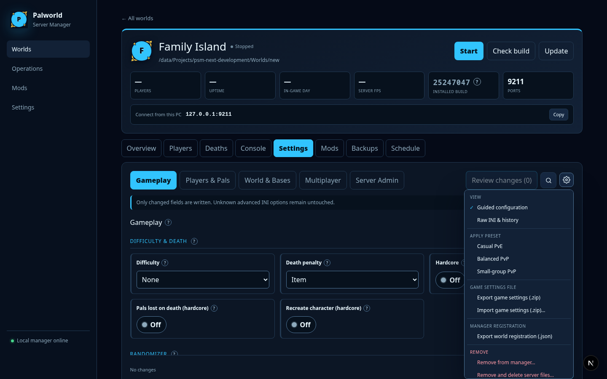 |

| Mods | Backups |
| --- | --- |
| 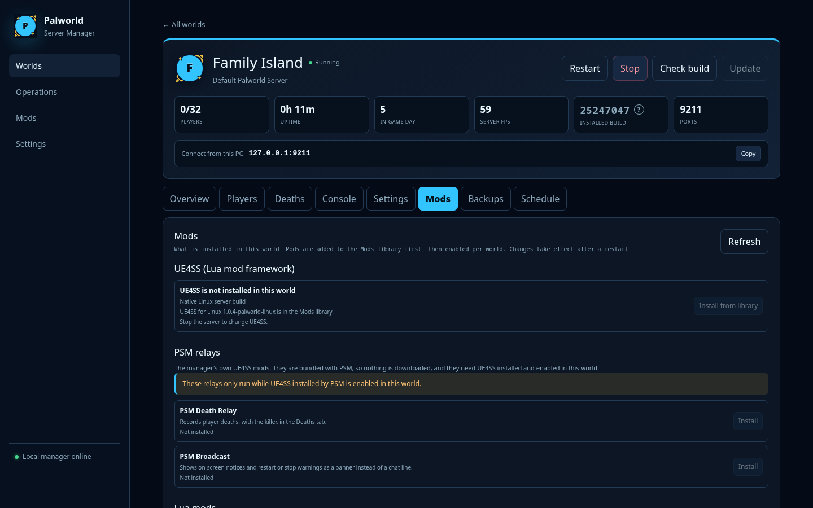 | 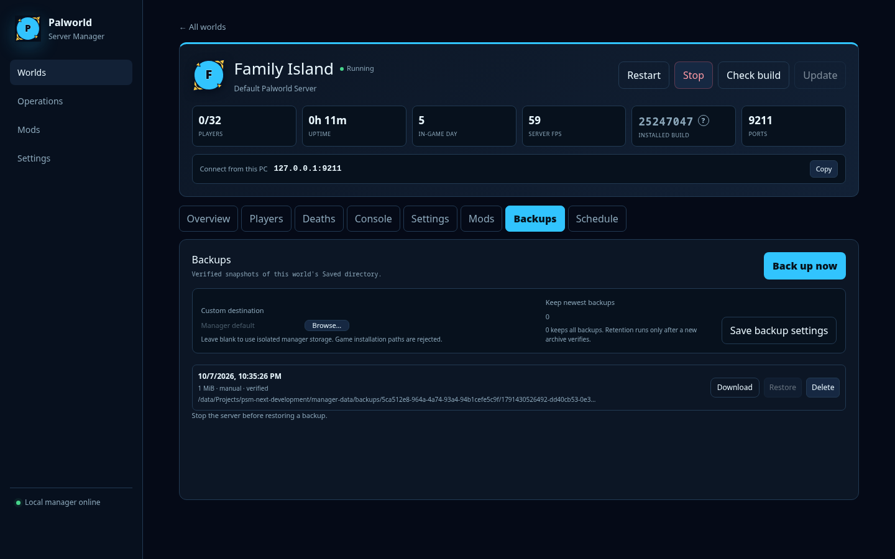 |

| Schedule | Operations |
| --- | --- |
| 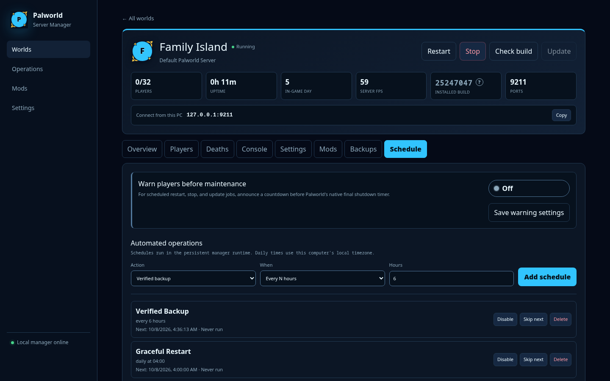 | 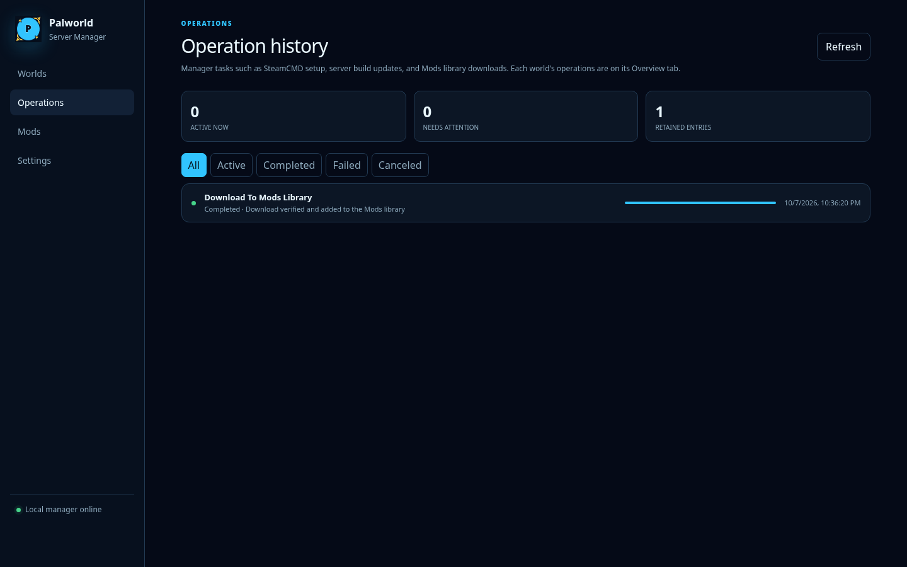 |

| Application settings | Mods library |
| --- | --- |
| 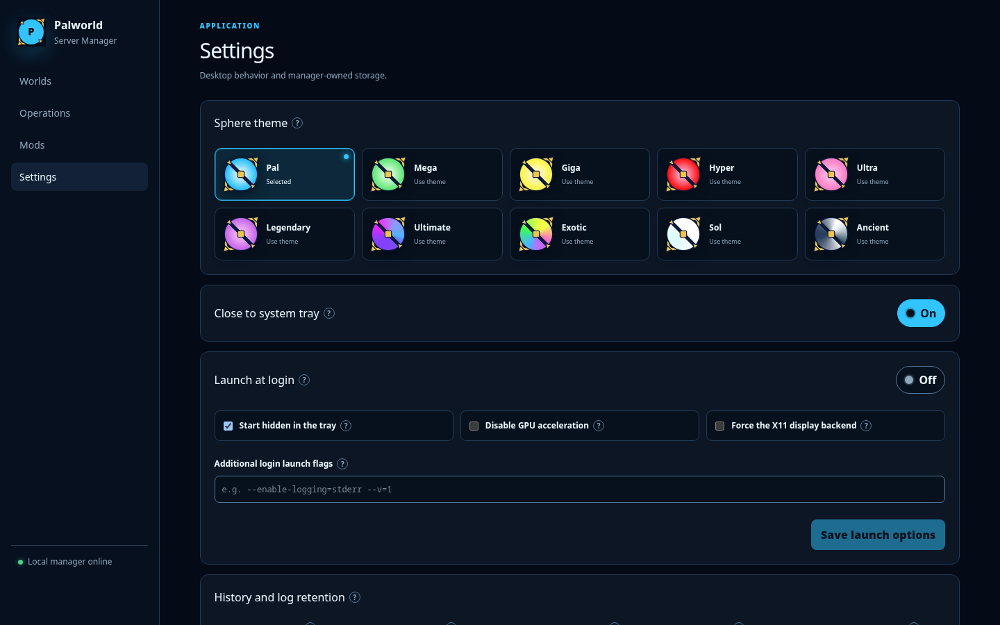 | 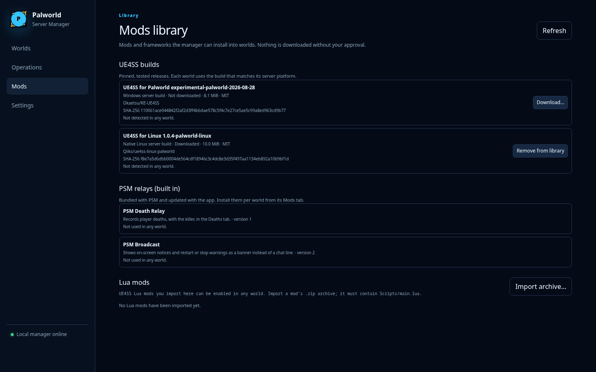 |

| Deleting a world | |
| --- | --- |
| 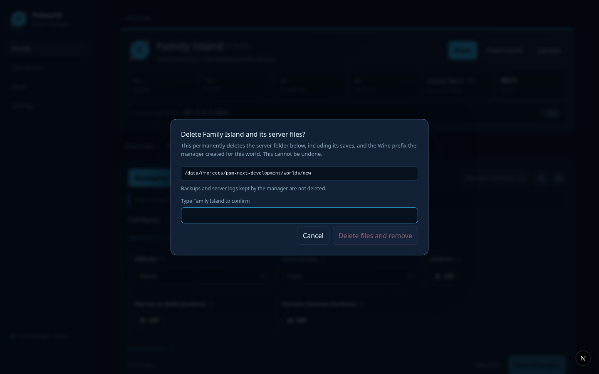 | |

## What it does

- **Install or adopt servers.** Download a fresh Palworld dedicated server through SteamCMD, or register an existing `PalServer` folder with **Use existing server**. Adopted servers keep their world, settings, and passwords; the app never moves or copies them.
- **Run several worlds side by side.** Every world has its own folder and its own game, query, REST, and RCON ports. New worlds are offered the next free ports, two worlds may not share or nest folders, and the dashboard starts, restarts, or stops them together.
- **Linux and Windows servers, on either host.** A Linux world runs natively on Linux. A Windows world runs natively on Windows, or headless under Wine on a Linux host with a prefix the app owns.
- **Start, stop, restart, and update** with one click. Stops save the world and shut down gracefully, with force-stop as a fallback. A crash guard restarts a server that dies, worlds can start with the app, and running servers are picked up again after the app restarts.
- **Guided settings.** Every field of `PalWorldSettings.ini` grouped into Gameplay, Players & Pals, World & Bases, Multiplayer, and Server Admin, with help text, search, presets you review before saving, default markers, and per-field revert. Only the values you change are written. A raw INI view keeps a version history you can restore.
- **Players.** See who is online with level, ping, and location, keep a history of known players with join counts and last-seen times, and kick, ban, or unban through Palworld's REST API. Send announcements and save the world from the Console tab.
- **Deaths.** A history of player deaths and their causes, fed by the built-in PSM Death Relay mod.
- **Console.** The live server log with pause, search, file selection, and download.
- **Backups.** ZIP backups of the save folder, verified after they are written, with retention limits, custom destinations (any local folder, including a mounted drive or network share), download, and restore (restores run on a stopped server and take a safety backup first). A running server is asked to save first so the archive is current.
- **Schedule.** Backups (only while the server is running), graceful restarts and stops with in-game warnings, updates (skipped without a restart when the server is already on the latest build), system messages, on-join welcome messages, stop-when-empty, and HTTP calls, on a minute, hourly, or daily cadence. Each action explains its steps in the Schedule tab.
- **Mods.** Install UE4SS, import and toggle Lua mods, toggle Steam Workshop mods, and enable the PSM relays. Mods survive server updates, and an integrity report repairs what an update disturbed.
- **Server builds.** One shared SteamCMD, a single check for the latest Palworld build across all worlds, and **Update all outdated worlds**, which warns players, stops, backs up, updates, and restarts each world in turn.
- **Your app, your way.** Ten color themes, language packs, close to tray, start minimized to the tray, launch at login, and a Stable or Prerelease update channel. Export and import a world's registration or its game settings as files.

Everything runs on your machine. The app listens only on `127.0.0.1`, has no accounts, and sends nothing to the developer. See the [privacy policy](./PRIVACY.md).

## Download

Get the latest build from the [**Releases**](https://github.com/valeryan/palworld-server-manager/releases) page.

| Platform | File | Notes |
| --- | --- | --- |
| Linux | `Palworld-Server-Manager-<version>-x86_64.AppImage` | Make it executable (`chmod +x`) and run it. |
| Windows installer | `Palworld-Server-Manager-<version>-Setup-x64.exe` | Installs per user; data lives in your profile. |
| Windows portable | `Palworld-Server-Manager-<version>-Portable-x64.exe` | No install. Keeps its data in a `PSM-Data` folder beside the exe, so keep that folder when you replace the exe. |

The Windows builds are not code-signed, so SmartScreen may warn about an unrecognized app. Choose **More info → Run anyway**. Windows builds need writable local NTFS storage; network and UNC paths are not supported.

Versions with a `-pre.N` suffix are prereleases. The app's **Stable** update channel ignores them; switch to **Prerelease** in Settings to be offered them.

## Getting started

1. **Launch the app.** It opens on **Worlds**, which is empty until you add a server.
2. **Add a world** with **+ New world**:
   - **Install a new server** into an empty folder. The app downloads SteamCMD and the dedicated server for you; progress shows on the world's Overview tab.
   - **Use existing server** registers a folder that already contains `PalServer.sh` or `PalServer.exe`, for example `Steam/steamapps/common/PalServer`. Nothing is downloaded or changed. A server that is already running from that folder is picked up as running.
   Pick a name, confirm the suggested ports, and choose Linux or Windows (Wine) for the server platform.
3. **Start it** from the dashboard or the world's header. The first start of a new server takes a moment while Palworld creates its save.
4. **Manage it** through the tabs: Overview, Players, Deaths, Console, Settings, Mods, Backups, Schedule.

### Connecting to your server

The world's Overview tab shows the address for this PC under **Connect from this PC**, for example `127.0.0.1:8211`. In Palworld choose **Join Multiplayer → Connect via IP** and paste it. Players on your network use your machine's LAN address with the same port.

For players on the internet, forward the world's game port (UDP) on your router or use a tunneling service, then share your public address. To list the server in Palworld's public browser, turn on **Community server** under **Settings → Server Admin**; it uses the game port unless you set a different public port.

### Settings and restarts

Palworld reads its settings when the server starts, so changes take effect on the next restart. The app shows a restart-required marker until then and only writes the fields you changed, so in-game choices and anything it does not know about are left alone. Ports, passwords, REST, and RCON live under **Server Admin** and are kept in sync with the INI for you.

### Keeping servers up to date

**Settings → Server builds** shows the shared SteamCMD, checks Steam once for the latest build, and lists which worlds are behind. **Update all outdated worlds** handles each one in turn: warn players, stop, back up, update, restart. A single world can also be checked and updated from its header. Mods are preserved through updates and repaired if an update disturbs them.

## Where your data lives

The app keeps its registry (the list of worlds and their history), logs, backups by default, the shared SteamCMD, the mods library, and language packs in one data folder. **Settings → Manager data** shows the exact path.

| Install | Data folder |
| --- | --- |
| Linux AppImage | `~/.config/palworld-server-manager-next/` |
| Windows installer | `%APPDATA%\palworld-server-manager-next\` |
| Windows portable | `PSM-Data` next to the exe |

Your Palworld servers, their saves, and their settings stay in each server's own folder. Removing a world from the app (**Settings options → Remove from manager…**) leaves that folder untouched; **Remove and delete server files…** deletes it after you type the world's name, and the app's backups and server logs for that world are kept.

## Updating the app

The sidebar shows when a newer version is available on your update channel. Updating is a manual replacement: download the new file from Releases, quit the app, and launch the new AppImage, run the new Setup, or replace the portable exe (keeping `PSM-Data`). Before the first launch of a new version runs any database migration, it takes a verified backup of the registry and restores it automatically if the migration fails.

Until version 1.0.0 the registry format is still settling, so a database created by an earlier prerelease is refused on startup with a message asking you to delete it and start again. Your worlds are unaffected: delete `registry-v3.sqlite` in the data folder and add them back with **Use existing server**.

## Troubleshooting

- **"Desktop authentication required"** in a browser tab means you opened the app's local address outside the app window. Use the app window; the server only answers its own window.
- **A world will not start on Windows** and the Installation card reports missing prerequisites: use its repair action, which installs the Visual C++ runtime the dedicated server needs.
- **Installing or updating a server fails on Windows with SteamCMD exit code 4294967294**: SteamCMD cannot run from a folder whose path contains non-English characters, and the installed app keeps it under `%APPDATA%\palworld-server-manager-next`, which includes your Windows username. Until the app moves SteamCMD elsewhere in that case, use the portable exe from a plain folder such as `C:\PSM`.
- **Ports already in use**: every port must be unique across worlds and free on the host. Pick different ports under **Settings → Server Admin**, then restart.
- **A server is running but the app shows it stopped**: add its folder with **Use existing server**; the app attaches to the running process so it can be monitored and stopped.
- **Something went wrong during an operation**: the **Operations** page keeps every job's output. The app's own launcher log is `launcher-v3.log` in the data folder.

## Development

Requirements: Node.js 24 (`nvm use` picks it up from `.nvmrc`), npm 11, and Linux (the Windows executables are cross-built through Wine).

```bash
npm install
npm run dev
```

Development uses port `4319` and a self-contained profile at `../psm-next-development/manager-data`, created on first launch; it never touches the production data folder. `npm run dev:web` and `npm run dev:electron` start the two halves separately. Development worlds default to ports 9211/28015/9212/26575 so they do not collide with production servers on the same machine. To work against a copy of a real server, copy its folder next to the development profile and add it with **Use existing server**.

```bash
npm run typecheck     # TypeScript
npm run lint          # ESLint
npm run check:cycles  # import cycles
npm test              # unit tests (Vitest)
npm run test:e2e      # browser and packaged-Electron workflows (Playwright)
npm run release       # AppImage, Setup, and Portable builds into release/ with SHA256SUMS.txt
```

`npm run release` only builds; run the checks separately. `npm run dist:linux` and `npm run dist:windows` build one platform. `node scripts/screenshots.mjs stopped|running` refreshes the README screenshots from the running development app (see the script header).

Further reading:

- [Release process](./docs/RELEASING.md): the Prepare, Publish, and Build release workflows and prerelease versioning.
- [Language packs](./docs/LANGUAGE-PACKS.md): the translation pack format.
- [Privacy policy](./PRIVACY.md).

## Safety model

- The app's registry is its own SQLite database. Existing servers are registered in place, and the app never reads another manager's data.
- Operations are serialized per world and recorded as persistent jobs; active jobs are never pruned by retention.
- Backups are verified before use, restores require a stopped server and take a pre-restore backup, and deleting server files requires typing the world's name.
- API responses never include server passwords, admin passwords, or process environment variables.
- English is the protected fallback language; incomplete language packs fall back to it.
